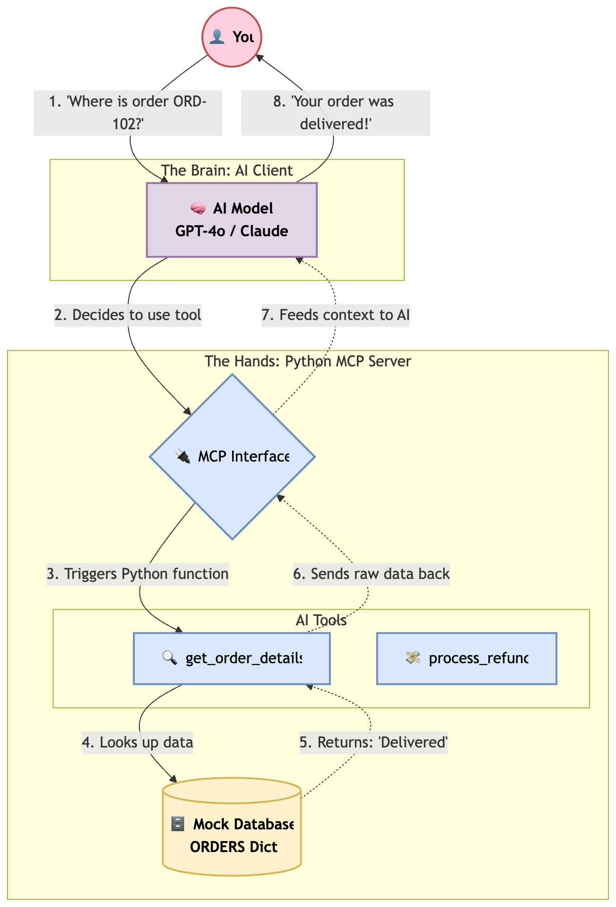

# From Python Application to MCP Server

A beginner-friendly project that demonstrates how to convert a traditional Python application into a **Model Context Protocol (MCP)** compatible server.

The sample app uses a simple customer support workflow, but the main goal is broader: to show how existing Python business logic can be exposed as MCP tools and used by AI clients such as **Cline**, **Claude Desktop**, **Cursor**, and other MCP-compatible agents.

## Table of Contents

- [From Python Application to MCP Server](#from-python-application-to-mcp-server)
  - [Overview](#overview)
  - [Why MCP?](#why-mcp)
  - [Architecture](#architecture)
  - [Who Is This Project For?](#who-is-this-project-for)
  - [What This Project Demonstrates](#what-this-project-demonstrates)
  - [Example Workflow](#example-workflow)
    - [User request](#user-request)
    - [AI client behavior](#ai-client-behavior)
    - [MCP server behavior](#mcp-server-behavior)
    - [Final AI response](#final-ai-response)
  - [Available Tools](#available-tools)
  - [Project Structure](#project-structure)
  - [Getting Started](#getting-started)
    - [1. Clone the repository](#1-clone-the-repository)
    - [2. Create a virtual environment](#2-create-a-virtual-environment)
    - [3. Install dependencies](#3-install-dependencies)
    - [4. Run the MCP server](#4-run-the-mcp-server)
  - [Configure an MCP AI Client](#configure-an-mcp-ai-client)
  - [Try the Demo](#try-the-demo)
  - [Real-World Applications](#real-world-applications)
  - [Future Enhancements](#future-enhancements)
  - [Key Takeaway](#key-takeaway)
  - [References](#references)


## Overview

Traditional applications usually expose functionality through user interfaces, REST APIs, SDKs, or custom integrations. MCP provides a standardized way for AI agents to discover and call application functionality directly.

This project shows how to take regular Python functions and expose them through an MCP server using **FastMCP**.

In this repository, the example domain is customer support:

- Look up order details
- Check product inventory
- Process refunds

The domain is intentionally simple so the MCP architecture is easy to understand.

## Why MCP?

Without MCP, each AI integration usually requires custom routing logic, custom API wrappers, and application-specific orchestration.

```text
AI Assistant
  |
  v
Custom API Integration
  |
  v
Application
```

With MCP, any compatible AI client can discover and call tools through a shared protocol.

```text
AI Client
  |
  v
MCP Protocol
  |
  v
MCP Server
  |
  v
Application Logic
```

This reduces integration complexity and makes application functionality easier to reuse across different AI clients.

## Architecture



## Who Is This Project For?

This project is designed for:

- Developers learning MCP
- Data scientists exploring Agentic AI
- Engineers interested in AI tool integrations
- Anyone who wants to expose an existing Python application to AI agents

No prior MCP experience is required.

At a high level:

1. A user asks a question in an AI client.
2. The AI client discovers tools exposed by the MCP server.
3. The AI selects the right tool for the task.
4. The MCP server runs the underlying Python application logic.
5. The result is returned to the AI client.
6. The AI turns the result into a natural language response.

## What This Project Demonstrates

This project demonstrates how to:

- Build an MCP server using FastMCP
- Expose Python functions as MCP tools
- Connect an MCP server to an AI client
- Let AI agents discover tools automatically
- Enable natural language interaction with application logic
- Understand the architecture behind agentic AI integrations

## Example Workflow

### User request

```text
Can I exchange my keyboard?
```

### AI client behavior

The AI client analyzes the request and discovers the tools exposed by the MCP server.

It may choose to call:

```python
check_inventory("Keyboard")
```

### MCP server behavior

The MCP server executes the Python function and returns the result.

Example result:

```text
Keyboard is currently out of stock.
```

### Final AI response

```text
The keyboard is currently out of stock, so an exchange is not available at this time.
```

## Available Tools

The sample MCP server exposes the following tools:

```python
get_order_details()
check_inventory()
process_refund()
```

These are simple examples of business capabilities that an AI client can discover and invoke through MCP.

## Project Structure

```text
project/
|-- src/
|   `-- server.py
|-- mermaid-mcp-architecture.png
|-- requirements.txt
|-- README.md
`-- .gitignore
```

## Getting Started

### 1. Clone the repository

```bash
git clone <repository-url>
cd <repository-name>
```

### 2. Create a virtual environment

```bash
python -m venv .venv
```

Activate it:

```bash
source .venv/bin/activate
```

On Windows:

```bash
.venv\Scripts\activate
```

### 3. Install dependencies

```bash
pip install -r requirements.txt
```

### 4. Run the MCP server

```bash
python src/server.py
```

## Configure an MCP AI Client

Add this server to your MCP-compatible AI client configuration.

Example Cline configuration:

```json
{
  "mcpServers": {
    "customer-support": {
      "command": "python",
      "args": ["src/server.py"]
    }
  }
}
```

## Try the Demo

After configuring your MCP client, ask:

```text
What MCP tools do you have available?
```

The client should discover:

```text
get_order_details
check_inventory
process_refund
```

Then try a natural language request:

```text
Can I exchange my keyboard?
```

The AI client should:

1. Discover the available MCP tools
2. Select the most relevant tool
3. Execute the tool through the MCP server
4. Interpret the returned result
5. Respond in natural language

## Real-World Applications

The same MCP pattern can be applied to many systems, including:

- Adobe Analytics
- Adobe Target
- Jira
- GitHub
- CRM systems
- Databases
- Internal reporting platforms
- Inventory management systems
- Enterprise applications

Any application with callable functionality can be transformed into an MCP-compatible server.

## Future Enhancements

Possible next steps:

- Add real database integration
- Add authentication and authorization
- Connect to external MCP Servers
- Deploy the MCP server remotely
- Integrate with enterprise systems

## Key Takeaway

This project is not really about customer support.

It is about demonstrating how a traditional Python application can be transformed into an MCP-compatible service and made accessible to AI agents through natural language.

## References

1. Model Context Protocol. *Getting Started Guide*. Available at: https://modelcontextprotocol.io/docs/getting-started/intro

2. Cyanheads. *Model Context Protocol Resources Repository*. GitHub. Available at: https://github.com/cyanheads/model-context-protocol-resources

3. FastMCP. *Getting Started Documentation*. Available at: https://gofastmcp.com/getting-started/welcome

4. Cline. *Cline Overview Documentation*. Available at: https://docs.cline.bot/cline-overview

